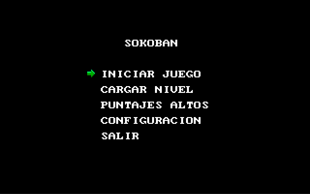

*Universidad de San Carlos de Guatemala*  
*Facultad de Ingenieria*  
*Escuela de Ciencias y Sistemas*  
*Arquitectura de Computadores y Ensambladores 1, 2023.*  
___
## **PROYECTO 2**
___
**201908355 - Danny Hugo Bryan Tejaxún Pichiyá**
___
# Manual De Usuario
## Ventanas Principales
### Pantalla Inicial
Muestra el nombre del juego y las iniciales del desarrollador.  
  
### Menú Principal
Muestra las distintas opciones que tiene el videojuego.  
  
### Iniciar Juego
Esta ventana es en donde se realizan las partidas. Existen 3 niveles. Aunque pueden cargarse más en la opción Cargar Nivel.  

  
A medida que se desarrolla el juego las cajas cambian de color según vayan ocupando posiciones de objetivos.  
  
  
### Controles del Juego
Inicialmentes puede controlarse el personaje jugable con las flechas del teclado. Esta configuración puede modificarse.  
### Cargar Nivel
En esta opción se podrán cargar nuevos niveles que no estén entre los predeterminados. Se cargará ingresando el nombre del archivo con su extensión.
  
### 
___
# Manual Técnico