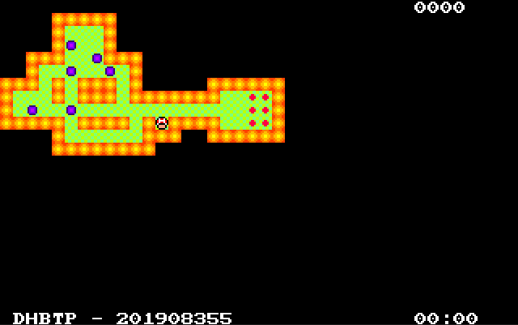
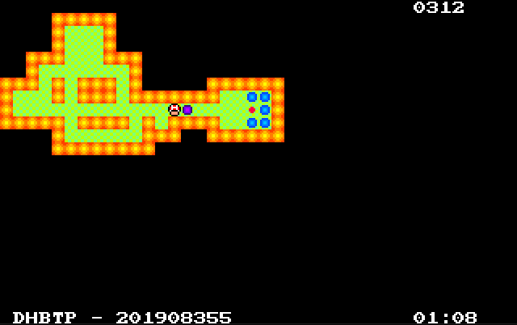

*Universidad de San Carlos de Guatemala*  
*Facultad de Ingenieria*  
*Escuela de Ciencias y Sistemas*  
*Arquitectura de Computadores y Ensambladores 1, 2023.*  
___
## **PROYECTO 2**
___
**201908355 - Danny Hugo Bryan Tejaxún Pichiyá**
___
# Manual De Usuario
## Ventanas Principales
### Pantalla Inicial
Muestra el nombre del juego y las iniciales del desarrollador.  
  
### Menú Principal
Muestra las distintas opciones que tiene el videojuego.  
  
### Iniciar Juego
Esta ventana es en donde se realizan las partidas. Existen 3 niveles. Aunque pueden cargarse más en la opción Cargar Nivel. En cada partida se lleva hace un conteo de tiempo y de movimientos realizados hasta el momento.  

  
A medida que se desarrolla el juego las cajas cambian de color según vayan ocupando posiciones de objetivos.  
  
  
### Controles Del Juego
Inicialmentes puede controlarse el personaje jugable con las flechas del teclado. Esta configuración puede modificarse.  
### Menú De Pausa
En esta opción se podrá retornar nuevamenta al juego para continuar la última partida o finalizarla e ir al menú principal.
  
### Cargar Nivel
En esta opción se podrán cargar nuevos niveles que no estén entre los predeterminados. Se cargará ingresando el nombre del archivo con su extensión.
  
### Objetos
Existen diferentes objetos en el entorno del juego.  
| No. | Objeto | No. | Objeto | No. | Objeto |
|:-|:-|:-|:-|:-|:-|
| 1.| Pared | 2.| Suelo | 3.| Jugador |
| 4.| Caja | 5.| Caja Sobre Objetivo | 6.| Objetivo |
| 7.| Flecha Menú |

  
___
# Manual Técnico
## Procedimientos Importantes
### Modo Juego
Se encarga de redireccionar el flujo del programa hacia la funcionalidad de jugar los niveles predeterminados y cargar su respectivo archivo de nivel.
```js
modo_juego:
		cmp [numeroNivel], 01
		je cargar_nivel1
		cmp [numeroNivel], 02
		je cargar_nivel2
		cmp [numeroNivel], 03
		je cargar_nivel3
		jmp menu

cargar_nivel1:
		mov DX, offset nivel1
		jmp cargar_un_nivel
cargar_nivel2:
		mov DX, offset nivel2
		jmp cargar_un_nivel
cargar_nivel3:
		mov DX, offset nivel3
		jmp cargar_un_nivel
```
### Modo Cargar Nivel
Se encarga de redirigir el flujo del programa hacia la funcionalidad de jugar un nivel cargado por el usuario. Se solicita el nombre del archivo y se procede normalmente como en el *Modo Juego* para este nivel. Para este modo se asigna el número de nivel como cero '0'.
```js
modo_cargar_nivel:
		;;
		call clear_pantalla
		;; ENTRADA
		;; <<-- POSICIONAR EL CURSOR
		mov DL, 0a        ; COLUMNA
		mov DH, 07        ; FILA
		mov BH, 00        ; NÚMERO DE PÁGINA
		mov AH, 02
		int 10
		;; IMPRESIÓN DEL MENSAJE
		push DX
		mov DX, offset nombre_archivo_nvl
		mov AH, 09
		int 21
		pop DX
leer_entrada_buffer:
		;; <<-- POSICIONAR EL CURSOR
		mov DL, 0a        ; COLUMNA
		mov DH, 09        ; FILA
		mov BH, 00        ; NÚMERO DE PÁGINA
		mov AH, 02
		int 10
		;; IMPRESIÓN DEL MENSAJE
		push DX
		mov DX, offset de_nivel
		mov AH, 09
		int 21
		pop DX
		;; LEER ENTRADA
		mov DX, offset buffer_entrada
		mov AH, 0a
		int 21
		mov DI, offset buffer_entrada
		call lengthBuffer
		cmp AL, 00
		je leer_entrada_buffer
		;; COPIAR BUFFER A NIVEL_X
		mov SI, offset nivel_x
		mov DI, offset buffer_entrada
		call memcpy
		mov [numeroNivel], 00
		mov DX, offset nivel_x
		jmp cargar_un_nivel
```
### Ciclo Principal Del Juego
Se encarga de enciclar el programa para leer las instrucciones por teclado del usuario y realizar las acciones necesarias y permitidas en el juego. El mapa del nivel se renderiza una única vez, que es al inicio, el resto del ciclo únincamente se renderiza al jugador y su alrrededor que se detalla en *Renderizar Jugador*. El Ciclo termina cuando se detecte la misma cantidad de cajas sobrepuestas y objetivos en el mapa y se redirecciona el flujo hacia *Avanzar Nivel*.
```js
ciclo_juego:
		call pintar_mapa
ciclo_juego1:
		mov AL, [cant_sobrepuestos]
		cmp [cant_objetivos], AL
		je avanzar_nivel
		call pintar_jugador_perimetro
		call entrada_juego
		jmp ciclo_juego1
```
### Avanzar Nivel
Se encarga de reiniciar los contadores de cajas sobrepuestas, cantidad de objetivos en el mapa, y las variables auxiliares utilizadas. Verifica el nivel del juego en que se está jugando, en el procedimiento *Modo Cargar Nivel* se asigna cero al nivel, este valor se evalúa ya que en ese modo se juega ese único nivel que se carga. De lo contrario incrementa el número del nivel y redirecciona al *Modo Juego* para validar si se jugarán más niveles posteriores al actual o ya no para redireccionarlo al menú principal.
```js
avanzar_nivel:
		mov [cant_sobrepuestos], 00
		mov [cant_sobre_aux], 00
		mov [cant_objetivos], 00
		cmp [numeroNivel], 00
		je menu
		inc [numeroNivel]
		jmp modo_juego
```
### Renderizar Jugador
En lugar de renderizar todo el mapa, se renderiza solo el jugador y sus casillas adyacentes para optimizar el tiempo de reacción desde que se presiona alguna tecla direccional para mover al jugador.
```js
pintar_jugador_perimetro:
		mov AL, [yJugador]   ;; fila
		mov AH, [xJugador]   ;; columna
		;; PINTAR JUGADOR
		push AX
		call adaptar_coordenada
		mov SI, offset dim_sprite_jug
		mov DI, offset data_sprite_jug
		call pintar_sprite
		pop AX
		;; PINTAR PERÍMETRO JUGADOR
		;; IZQUIERDA
		dec AH
		push AX
		call obtener_de_mapa
		pop AX
		call pintar_perimetro
		;; PINTAR PERÍMETRO JUGADOR
		;; DERECHA
		inc AH
		inc AH
		push AX
		call obtener_de_mapa
		pop AX
		call pintar_perimetro
		;; PINTAR PERÍMETRO JUGADOR
		;; ARRIBA
		dec AH
		dec AL
		push AX
		call obtener_de_mapa
		pop AX
		call pintar_perimetro
		;; PINTAR PERÍMETRO JUGADOR
		;; ABAJO
		inc AL
		inc AL
		push AX
		call obtener_de_mapa
		pop AX
		call pintar_perimetro
		ret
pintar_perimetro:
		cmp DL, PARED
		je pintar_pared_mapa_p
		cmp DL, CAJA
		je pintar_caja_mapa_p
		cmp DL, OBJETIVO
		je pintar_objetivo_mapa_p
		cmp DL, SOBREPUESTO
		je pintar_sobrepuesto_mapa_p
		cmp DL, SUELO
		je pintar_suelo_mapa_p
pintar_suelo_mapa_p:
		push AX
		call adaptar_coordenada
		mov SI, offset dim_sprite_suelo
		mov DI, offset data_sprite_suelo
		call pintar_sprite
		pop AX
		jmp terminar_perimetro
pintar_pared_mapa_p:
		push AX
		call adaptar_coordenada
		mov SI, offset dim_sprite_pared
		mov DI, offset data_sprite_pared
		call pintar_sprite
		pop AX
		jmp terminar_perimetro
pintar_caja_mapa_p:
		push AX
		call adaptar_coordenada
		mov SI, offset dim_sprite_caja
		mov DI, offset data_sprite_caja
		call pintar_sprite
		pop AX
		jmp terminar_perimetro
pintar_objetivo_mapa_p:
		push AX
		call adaptar_coordenada
		mov SI, offset dim_sprite_obj
		mov DI, offset data_sprite_obj
		call pintar_sprite
		pop AX
		jmp terminar_perimetro
pintar_sobrepuesto_mapa_p:
		push AX
		call adaptar_coordenada
		mov SI, offset dim_sprite_sobre
		mov DI, offset data_sprite_sobre
		call pintar_sprite
		pop AX
		jmp terminar_perimetro
terminar_perimetro:
		ret
```
### Mover Jugador
Se encarga de localizar al jugador en la posición actual, y manipula las coordenadas, según sea el caso, para posicionarlo en un lugar diferente del mapa.
Hace las validaciones de la posición a la que se quiere mover. Existen 4 casos que son:
* Si hay pared.
* Si hay un objetivo.
* Si hay una caja sobrepuesta a un objetivo.
* Si hay una caja.
```js
mover_jugador_arr:
		mov AH, [xJugador]
		mov AL, [yJugador]
		dec AL
		push AX
		call obtener_de_mapa
		pop AX
		;; VALIDAR SI EL DESTINO ES UNA PARED
		;; DL <- ELEMENTO EN EL MAPA
		cmp DL, PARED
		je hay_pared_arriba
		mov [yJugador], AL
		;; VALIDAR SI EL DESTINO ES UN OBJETIVO
		;; DL <- ELEMENTO EN EL MAPA
		cmp DL, OBJETIVO
		je encuentra_objetivo1
		;; VALIDAR SI EL DESTINO ES UN SOBREPUESTO
		cmp DL, SOBREPUESTO
		je mueve_sobrepuesto1
		;; VALIDAR SI SE ENCUENTRA UNA CAJA EN LA SIGUIENTE CASILLA
		cmp DL, CAJA
		je encuentra_caja1
		jmp continuar1
```
### Encuentra Objetivo
Reasigna el valor de la etiqueta para este caso con valor de 1 para validar que se está moviendo a una posición en la que existe un objetivo para posteriormente devolverlo a ese lugar cuando el jugador abandone esa posición.
```js
encuentra_objetivo1:
		mov [hay_objetivo_sig], 01
		jmp continuar1
```
### Encuentra Caja
Se utiliza para validar qué objeto hay después de la caja que se quiere mover y realizar las acciones necesarias. Existen 4 casos que son:
* Si hay pared.
* Si hay una caja sobrepuesta a un objetivo.
* Si hay una caja.
* Si hay un objetivo.
```js
encuentra_caja1:
		;;;;;;;;;;;;;;;;;;;;;;;;;;;;;;;;;;;;;;
		dec AL
		push AX
		call obtener_de_mapa
		pop AX
		;; VALIDAR SI HAY PARED DESPUÉS DE LA CAJA
		cmp DL, PARED
		je no_pasa_arriba
		;; VALIDAR SI HAY UN SOBREPUESTO DESPUÉS DE LA CAJA
		cmp DL, SOBREPUESTO
		je no_pasa_arriba
		;; VALIDAR SI HAY OTRA CAJA DESPUÉS DE LA CAJA
		cmp DL, CAJA
		je no_pasa_arriba
		;; VALIDAR SI HAY UN OBJETIVO DESPUÉS DE LA CAJA
		cmp DL, OBJETIVO
		je sobreponer1
		jmp mover_caja1
```
### Sobreponer Caja En Un Objetivo
Se coloca un objeto distinto a una caja pero con la apariencia similar a la de una caja. Es un objeto distinto a la caja para fines del desarrollo de la lógica y la jugabilidad, pero para el jugador es una caja. Incrementa la cantidad de cajas sobrepuestas.
```js
sobreponer1:
		inc [cant_sobrepuestos]
		inc AL
		push AX
		call obtener_de_mapa
		pop AX
		;;;;;;;;;;;;;;;;;;;;;;;;;;;;;;;;;;;;;;
		mov DL, SOBREPUESTO
		dec AL
		push AX
		call colocar_en_mapa
		pop AX
		inc AL
		jmp continuar1
```
### Mover Caja Sobrepuesta A Un Objetivo
Disminuye la cantidad de cajas sobrepustas y salta a las validaciones para una caja cualquiera.
```js
mueve_sobrepuesto1:
		dec [cant_sobrepuestos]
		mov [hay_objetivo_sig], 01
		jmp encuentra_caja1
```
### Mover Caja
Luego de las validaciones se mueve la caja si se da el caso de que pueda moverse.
```js
mover_caja1:
		inc AL
		push AX
		call obtener_de_mapa
		pop AX
seguir_moviendo_caja1:
		mov DL, CAJA
		dec AL
		push AX
		call colocar_en_mapa
		pop AX
		inc AL
```
### Continuación Luego De Validaciones
Se encarga de posicionar al jugador en su nueva posición, validar que el lugar del que salió haya o no un objetivo, si hay un objetivo renderiza el objetivo en esa posición de lo contrario renderiza un objeto suelo.
```js
continuar1:
		;; POSICIONAR AL JUGADOR EN EL MAPA
		mov DL, JUGADOR
		push AX
		call colocar_en_mapa
		pop AX
		;; VALIDAR SI EL JUGADOR ESTÁ SOBRE UN OBJETIVO
		cmp [hay_objetivo_act], 01
		je devolver_objetivo1
		;;
		mov BL, [hay_objetivo_sig]
		mov [hay_objetivo_act], BL
		mov [hay_objetivo_sig], 00
		;;
		mov DL, SUELO
		inc AL
		call colocar_en_mapa
		mov AL, [cant_sobrepuestos]
		mov [cant_sobre_aux], AL
```
### Devolver Objetivo
Se encarga de renderizar un objetivo en la posición de la que salió el jugador. Realiza un intercambio de valores de etiquetas para validar la presencia de un objetivo en la posición actual del jugador y la siguiente. También reasigna valores del conteo de cajas sobrepuestas en una variable auxiliar para tenerla como respaldo en caso de que un movimiento no sea válido.
```js
devolver_objetivo1:
		mov BL, [hay_objetivo_sig]
		mov [hay_objetivo_act], BL
		mov [hay_objetivo_sig], 00
		mov DL, OBJETIVO
		inc AL
		call colocar_en_mapa
		mov AL, [cant_sobrepuestos]
		mov [cant_sobre_aux], AL
```
### Hay Pared
Realiza las acciones en caso de que el movimiento sea inválido por existencia de una pared en el posible destino. Anula la posibilidad de que haya un objetivo en la posición siguiente. Reasigna la cantidad de cajas sobrepuestas auxiliar en la etiqueta principal para reestablecer su valor al dato anterior.
```js
hay_pared_arriba:
		mov [hay_objetivo_sig], 00
		mov AL, [cant_sobre_aux]
		mov [cant_sobrepuestos], AL
```
### No Pasa
Realiza las acciones en caso de que el jugador no pueda moverse en cierta dirección por cualquiera de los casos detallados en el procedimiento *Mover Caja*. Anula la posibilidad de que haya un objetivo en la posición siguiente. Reasigna la cantidad de cajas sobrepuestas auxiliar en la etiqueta principal para reestablecer su valor al dato anterior
```js
no_pasa_arriba:
		mov [hay_objetivo_sig], 00
		inc AL
		inc AL
		mov [yJugador], AL
		mov AL, [cant_sobre_aux]
		mov [cant_sobrepuestos], AL
```